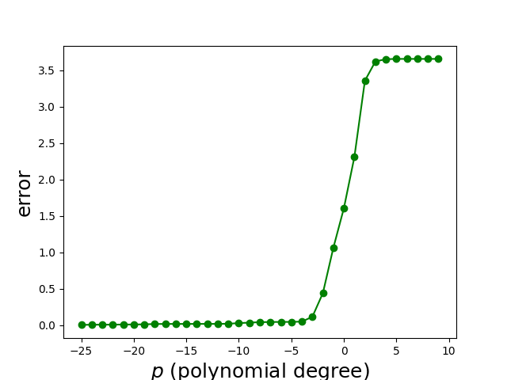

# Polynomial Regression with Regularization

This project implements **Closed form polynomial regression with regularization** using Python. The main focus is on generating synthetic polynomial data, fitting polynomial models with varying degrees and regularization parameters, and visualizing the results.

## Features

- Generate polynomial data with noise
- Fit polynomial regression models with and without regularization
- Visualize the fitting process and errors
- Split data into training and testing sets for evaluation

## Dependencies

- Python 3.x
- NumPy
- Matplotlib

## Installation

1. Clone the repository:
    ```bash
    git clone https://github.com/ramintavakolii/poly-regression-regularization.git
    cd poly-regression-regularization
    ```

2. Install the required dependencies:
    ```bash
    pip install numpy matplotlib
    ```

## Usage

1. Run the main script to generate data, fit models, and visualize the results:
    ```bash
    python main.py
    ```

2. You can modify the parameters in `main.py` to change the polynomial degree, regularization coefficients, noise level, and data range.

## Project Structure

- **polyreg.py**: Contains the `PolyReg` class implementation for polynomial regression.
- **main.py**: Main script to generate data, fit models, and plot results.
- **README.md**: Project documentation.

## Examples

### Generating and Plotting Data

The script generates polynomial data and fits polynomial regression models with and without regularization. Below are some example plots generated by the script:

#### Original Data
<p align="center">
  
</p>


#### Model Fitting with Different Regularization Parameters

<p align="center">
  
</p>

####  error vs regularization parameter
<p align="center">
  
</p>

#### Logarithm of Training and Testing Error
<p align="center">
  
</p>

## License

This project is licensed under the MIT License.

## Contributing

Contributions are welcome! Please fork the repository and submit a pull request for any improvements or bug fixes.

## Contact

For any questions or suggestions, please open an issue or contact the project maintainer.
